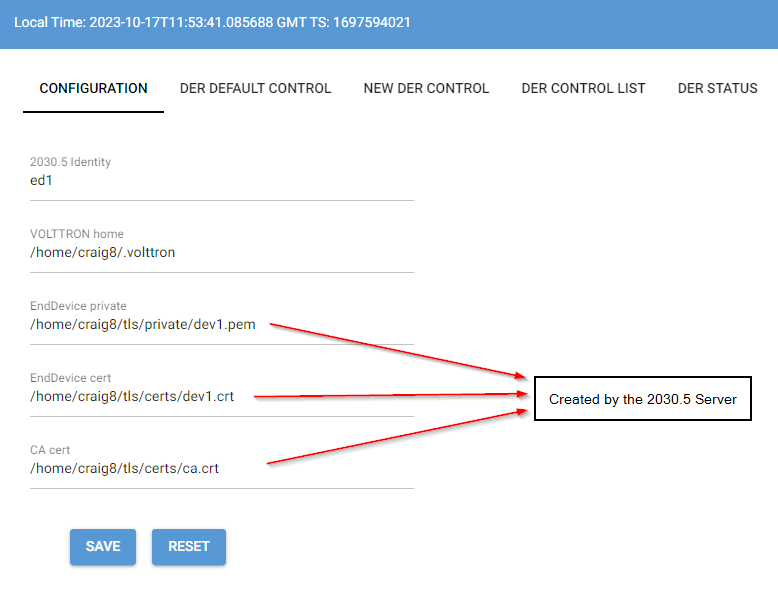
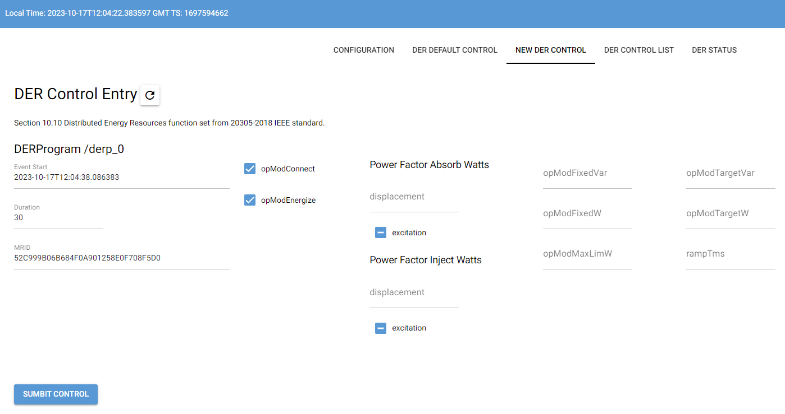

# Demo for 2030.5 Agent #

This document provides a walkthrough of a demonstration where an inverter publishes data points
to the VOLTTRON message bus. The 2030.5 agent receives these data points, creates MirrorUsagePoints,
and POSTs MirrorMeterReadings to the 2030.5 server. Additionally, the demo allows users to create a
DERControl event. When this event is activated, the agent logs messages to the 2030.5 server.

To run the demo, you will need to have three terminal windows open. The first terminal runs the main
VOLTTRON process. The second terminal runs the 2030.5 server. The third terminal runs the agent demo
via a web interface. For the purposes of this document, we assume that you have cloned the volttron
repository to a location referred to as VOLTTRON_ROOT.

The setup process involves configuring the 2030.5 server, setting up the VOLTTRON instance, and
finally launching the web-based demo.

## Setting up the 2030.5 Server ##

We will be using a 2030.5 server developed by a team at PNNL. The GridAPPS-D team has created this
server, which is available at <https://pypi.org/project/gridappsd-2030-5/>.  The version used while
creating this demo is version 0.0.2a14.  The source code is currently in a private repository, but
it will be made public in the future.

1. Open a new terminal and create a new virtual environment to install the gridappsd server. Please
   note that this directory should be separate from the main volttron directory.

    ```bash
    > mkdir 2030_5_server
    > cd 2030_5_server

    # creates an environment 'serverenv' in the current directory
    > python3 -m venv serverenv

    > source serverenv/bin/activate

    (serverenv)> pip install gridappsd-2030-5
    ```

1. Now, you need to adjust the `openssl.cnf` file to match your specific requirements. You can also
   use the default settings. This file is used to create self-signed certificates for the client to
   use.

   Copy the openssl.cnf and server.yml files from the $VOLTTRON_ROOT/services/core/IEEE_2030_5/demo
   directory to the newly created 2030_5_server directory.  After copying the current directory should
   look like the following.

    ```bash
    (serverenv)> ls -l
        serverenv/
        openssl.cnf
        server.yml
    ```

1. Next, modify the `server.yml` file. The default `server.yml` file includes a device (id: dev1) and
   a DERProgram. It's important to note that `dev1` must be present for the demo to run smoothly.

1. Finally, start the server from the activated `serverenv`. This step will generate development
   certificates for you. By default, the certificates will be stored in `~/tls`. You can change this
   location in the `server.yml` configuration file, however the agent configuration file will also need
   to be changed.

    ```bash
    (serverenv)> 2030_5_server server.yml --no-validate

    # without creating certificates
    # (serverenv)> 2030_5_server server.yml --no-validate --no-create-certs
    ```

## Demo Requirements ##

This demo requires you to start a default VOLTTRON instance from the command line. This command will
run VOLTTRON in the background and write to a `volttron.log` file.

1. First, navigate to the VOLTTRON_ROOT directory and activate the virtual environment.

    ```bash
    > cd $VOLTTRON_ROOT
    > source env/bin/activate
    ```

1. Next, start the VOLTTRON instance.

    ```bash
    (volttron)> ./start-volttron
    ```

1. If you want to monitor the VOLTTRON log, you can use the following command:

    ```bash
    (volttron)> tail -f volttron.log
    ```

    >**Warning**
    >If monitoring the log then open a new command prompt before continuing and follow step 1
    >before continuing.

1. Install a platform.driver agent

    ```bash
    (volttron)> vctl install services/core/PlatformDriverAgent --start
    ```

1. Verify the platform.driver agent is running

    ```bash
    (volttron)> vctl status
    UUID AGENT                  IDENTITY            TAG STATUS          HEALTH
    da2c1f0d-6c platform_driveragent-4.0 platform.driver         running [476936]
    ```

1. Add config store files to the platform.driver.

    ```bash
    (volttron)> vctl config store 'platform.driver' 'devices/inverter1' 'services/core/IEEE_2030_5/demo/devices.inverter1.config'
    (volttron)> vctl config store 'platform.driver' 'inverter1.points.csv' 'services/core/IEEE_2030_5/demo/inverter1.points.csv' --csv
    ```

1. Add config store entries for the 2030.5 agent.  We will use the identity `ed1`` for the agent.

    ```bash
    (volttron)> vctl config store 'ed1' inverter_sample.csv services/core/IEEE_2030_5/inverter_sample.csv --csv
    ```

1. Install and start the 2030.5 agent.

    ```bash
    (volttron)> vctl install services/core/IEEE_2030_5/ --vip-identity ed1 --start --agent-config services/core/IEEE_2030_5/example.config.yml
    ```

1. Finally start the web based demo. This should open a webpage allowing one
   to test the functionality of the 2030.5 agent.  By default it will open at <http://0.0.0.0:8080>.
   If this does not work you can browse to <http://localhost:8080> and that should work as well.

    ```bash
    (volttron)> cd services/core/IEEE_2030_5
    (volttron)> pip install -r requirements_demo.txt
    (volttron)> python demo/webgui.py
    ...
    ```

## The Demo ##

Once you start the demo, you'll see the local time displayed at the top, followed by the 2030.5 GMT
time represented as an integer. This integer representation is how the 2030.5 protocol communicates
datetime values.

The demo interface includes six tabs:

### Configuration Tab ###

The "Configuration Tab" in the demo interface is typically used to set up and manage the configuration
settings for the demo.

By adjusting these settings, you can customize the behavior of the demo to suit your specific needs.



### DER Default Control Tab ###

The "DER Default Control Tab" in the demo interface allows you to set default operational parameters
for Distributed Energy Resources (DERs).

In this tab, you can specify the default mode for the inverter to operate in. Once you set the
parameters and click on the "Save" button, these default control settings are sent to the server.
The 2030.5 agent then polls the server and retrieves these default values to control the operation
of the DERs.


### New DER Control Tab ###

The "New DER Control Tab" in the demo interface is used to create new DER Control events.

In this tab, you can specify the parameters for a new control event, such as the start and end times,
operational mode, and other settings. Once you've set these parameters, you can submit the new
control event. This event is then sent to the server and scheduled for execution.



This tab is crucial for scheduling specific control events that override the default operational
parameters set in the "DER Default Control Tab". These events allow for more dynamic and responsive
control of the DERs based on changing conditions or requirements.

### DER Control List Tab ###

The "DER Control List Tab" in the demo interface provides a comprehensive list of all the DER Control
events that have been scheduled.

This tab displays the status of each event, whether it's scheduled, active, or completed. It provides
an overview of all the control events, allowing you to monitor their progress and see when they are completed.

Here's how the interface looks in different states:

- No Events: 
- Scheduled: 
- Active: 
- Complete: 

This tab is crucial for managing and monitoring the control events that are used to dynamically control
the operation of the DERs.

### DER Status Tab ###

The "DER Status Tab" in the demo interface is used to monitor the current status of the DER.

This tab provides real-time information about the operation of the DER, including their current mode
of operation, power output, and other operational parameters.

### Usage Point Tab ###

The "Usage Point Tab" in the demo interface is used to display the usage points.

Usage points represent a collection of meter readings and are used to monitor the energy consumption
or production at a specific point. This could be a point of consumption like a building or a point of
production like a solar panel array.

By monitoring the Usage Point Tab, you can get a live view of how much energy is being consumed or
produced at each usage point. This can be useful for energy management, performance monitoring, and
ensuring that the energy production or consumption is as expected.


<!--
## Next Steps ##

The next step is to configure your own der and see how it performs.  Please see [CONFIGURE.md](CONFIGURE.md)
for information about the configuration file and config store entries for this agent. -->
