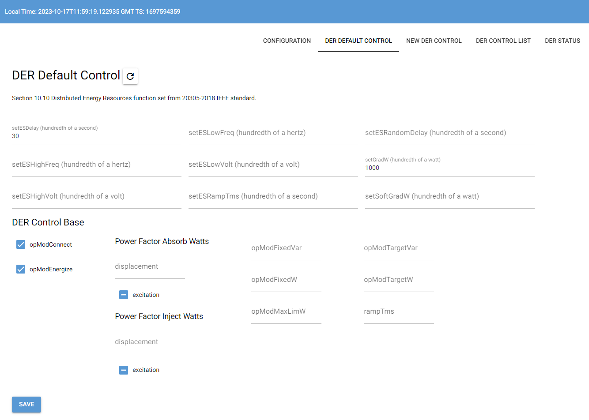
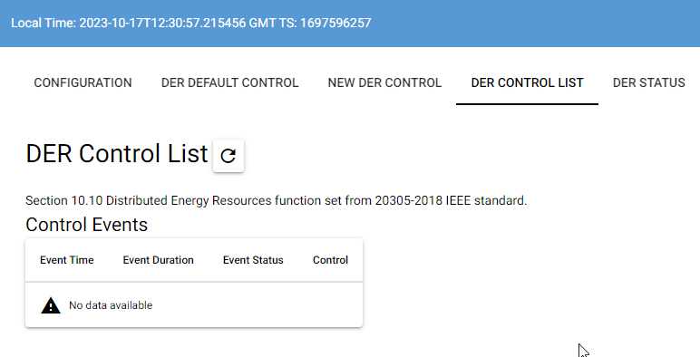

# Demo for 2030.5 Agent #

This document provides a walkthrough of a demonstration where an inverter publishes data points
to the VOLTTRON message bus. The 2030.5 agent receives these data points, creates MirrorUsagePoints,
and POSTs MirrorMeterReadings to the 2030.5 server. Additionally, the demo allows users to create a
DERControl event. When this event is activated, the agent logs messages to the 2030.5 server.

To run the demo, you will need to have three terminal windows open. The first terminal runs the main
VOLTTRON process. The second terminal runs the 2030.5 server. The third terminal runs the agent demo
via a web interface. For the purposes of this document, we assume that you have cloned the volttron
repository to a location referred to as VOLTTRON_ROOT.

The setup process involves configuring the 2030.5 server, setting up the VOLTTRON instance, and
finally launching the web-based demo.

## Setting up the 2030.5 Server ##

We will be using a 2030.5 server developed by a team at PNNL. The GridAPPS-D team has created this
server, which is available at <https://pypi.org/project/gridappsd-2030-5/>.  The version used while
creating this demo is version 0.0.2a14.  The source code is currently in a private repository, but
it will be made public in the future.

1. Open a new terminal and create a new virtual environment to install the gridappsd server. Please
   note that this directory should be separate from the main volttron directory.

    ```bash
    > mkdir 2030_5_server
    > cd 2030_5_server

    # creates an environment 'serverenv' in the current directory
    > python3 -m venv serverenv

    > source serverenv/bin/activate

    (serverenv)> pip install gridappsd-2030-5
    ```

1. Now, you need to adjust the `openssl.cnf` file to match your specific requirements. You can also
   use the default settings. This file is used to create self-signed certificates for the client to
   use.

   Copy the openssl.cnf and server.yml files from the $VOLTTRON_ROOT/services/core/IEEE_2030_5/demo
   directory to the newly created 2030_5_server directory.  After copying the current directory should
   look like the following.

    ```bash
    (serverenv)> ls -l
        serverenv/
        openssl.cnf
        server.yml
    ```

1. Next, modify the `server.yml` file. The default `server.yml` file includes a device (id: dev1) and
   a DERProgram. It's important to note that `dev1` must be present for the demo to run smoothly.

1. Finally, start the server from the activated `serverenv`. This step will generate development
   certificates for you. By default, the certificates will be stored in `~/tls`. You can change this
   location in the `server.yml` configuration file, however the agent configuration file will also need
   to be changed.

    ```bash
    (serverenv)> 2030_5_server server.yml --no-validate

    # without creating certificates
    # (serverenv)> 2030_5_server server.yml --no-validate --no-create-certs
    ```

## Demo Requirements ##

This demo requires you to start a default VOLTTRON instance from the command line. This command will
run VOLTTRON in the background and write to a `volttron.log` file.

1. First, navigate to the VOLTTRON_ROOT directory and activate the virtual environment.

    ```bash
    > cd $VOLTTRON_ROOT
    > source env/bin/activate
    ```

1. Next, start the VOLTTRON instance.

    ```bash
    (volttron)> ./start-volttron
    ```

1. If you want to monitor the VOLTTRON log, you can use the following command:

    ```bash
    (volttron)> tail -f volttron.log
    ```

    >**NOTE**
    >If you are monitoring the log then open a new command prompt before continuing and follow step 1
    >before continuing

1. Install a platform.driver agent

    ```bash
    (volttron)> vctl install service/core/PlatformDriverAgent --start
    ```

1. Verify the platform.driver agent is running

    ```bash
    (volttron)> vctl status
    UUID AGENT                  IDENTITY            TAG STATUS          HEALTH
    da2c1f0d-6c platform_driveragent-4.0 platform.driver         running [476936]
    ```

1. Add config store files to the platform.driver.

    ```bash
    (volttron)> vctl config store 'platform.driver' 'devices/inverter1' 'demo/devices.inverter1.config'
    (volttron)> vctl config store 'platform.driver' 'inverter.points.csv' 'demo/inverter.points.csv'
    ```

1. Open another terminal to install the 2030.5 agent and add it's property map to the configuration store.

    ```bash
    > cd $VOLTTRON_ROOT
    > source env/bin/activate
    (volttron)> vctl install services/core/IEEE_2030_5/ --vip-identity ed1 --agent-config services/core/IEEE_2030_5/example.config.yml
    (volttron)> vctl config store ed1 inverter_sample.csv services/core/IEEE_2030_5/inverter_sample.csv --csv
    ```

    <mark>Note ed1 is the identity that needs to be in the configuration on the web demo</mark>

1. Open another terminal to run a simulated platform.driver.  In this case, an inverter with a
   connected battery is being simulated.

    ```bash
    > cd $VOLTTRON_ROOT
    > source env/bin/activate
    (volttron)> pip install -r requirements_demo.txt
    (volttron)> python services/core/IEEE_2030_5/demo/inverter_runner.py
    ```

    This process will start publishing "all" messages for the inverter to the VOLTTRON message bus.

1. Open another terminal to start the demo server in.

    ```bash
    > cd $VOLTTRON_ROOT
    > source env/bin/activate
    (volttron)> cd services/core/IEEE_2030_5
    ...
    ```

1. Run the webgui.py script using the python interpretor.  This should open a webpage allowing one
   to test the functionality of the 2030.5 agent.  By default it will open at <http://0.0.0.0:8080>.

    ```bash
    (volttron)> python demo/webgui.py
    ```

## The Demo ##

The demo starts with local time in the top followed by 2030.5's GMT time as a intenger.  The integer
is how 2030.5 communicates datetimes within the protocol.  Five tabs are displayable and are
pictured below:


On the default control tab one can specify the default mode for the inverter to run in.  Clicking
on the save button sends the default control to the server where the agent will then poll and retrieve
the default value.






